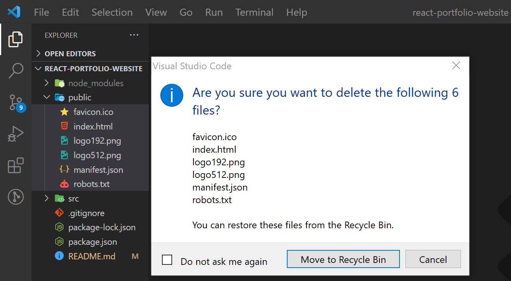

# 0. First steps

## 0.1. Create the project

Just run in your desktop `npx create-react-app yourAppName`

## 0.2. Let src folder and public folder empty




## 0.3. index.html

In public folder, create an index.html file, and write exclamation mark to set basic snippet structure.

Note: install ES7 React Snippets vsCode extension.

And create a div with id="root"

## 0.4. Create an Assets folfer inside src folder

There we'll set our images or any media files.

## 0.5. Create an index.js file in src folder

This file will be the only with js extension, rest will be jsx files.

Note: By the way, create a index.css in src folder too.

# 1. Let's create all components

## 1.1. App.jsx

Create and App.jsx file in src folder.

Write *"rafce"* to snip the basic estructure of a *"React Arrow Functional Component Export"*

```js
import React from 'react'

const App = () => {
  return (
    <div>App</div>
  )
}

export default App
```

## 1.2. Write basic imports in index.js

```js
import ReactDOM from 'react-dom/client';
import App from './App';
import './index.css';

const root = ReactDOM.createRoot(document.getElementById('root'));
root.render(
    <App />
);
```

## 1.3. First view in our browser

Just open a new terminal in vsCode and run `npm start`.

## 1.4. Let's create a components folder and css folder

Create these two folders inside src folder, to create the rest component and separate the jsx files and the css files.

## 1.5. Calling our components in App.jsx

Come back to App.jsx to call all components, between react fragments.

```jsx
import React from 'react'
import Header from './components/Header'
import Navbar from './components/Navbar'
import About from './components/About'
import Experience from './components/Experience'
import Services from './components/Services'
import Portfolio from './components/Portfolio'
import Testimonials from './components/Testimonials'
import Contact from './components/Contact'
import Footer from './components/Footer'

const App = () => {
  return (
    <>
      <Header />
      <Navbar />
      <About />
      <Experience />
      <Services />
      <Portfolio />
      <Testimonials />
      <Contact />
      <Footer />
    </>
  )
}

export default App
```

## 1.6. Setting the basic and general styles in index.css

```css
@import url('https://fonts.googleapis.com/css2?family=Poppins:wght@300;400;500;600&display=swap');

* {
    margin: 0;
    padding: 0;
    border: 0;
    outline: 0;
    box-sizing: border-box;
    list-style: none;
    text-decoration: none;
}

:root {
    --color-bg: #1f1f38;
    --color-bg-variant: #2c2c6c;
    --color-primary: #4db5ff;
    --color-primary-variant: rgba(77, 181, 255, 0.4);
    --color-white: #fff;
    --color-light: rgba(255, 255, 255, 0.6);

    --transition: all 400ms ease;

    --container-width-lg: 75%;
    --container-width-md: 86%;
    --container-width-sm: 90%;
}

html {
    scroll-behavior: smooth;
}

::-webkit-scrollbar {
    display: none;
}

body {
    font-family: 'Poppins', sans-serif;
    background: var(--color-bg);
    color: var(--color-white);
    line-height: 1.7;
    background-image: url(../src/assets/img/bg-texture.png);
}

/* ========================= GENERAL STYLES ======================== */

.container {
    width: var(--container-width-lg);
    margin: 0 auto;
}

h1, h2, h3, h4, h5 {
    font-weight: 500;
}

h1 {
    font-size: 2.5rem;
}

section {
    margin-top: 8rem;
}

section > h2, 
section > h5 {
    text-align: center;
    color: var(--color-light);
}

section > h2 {
    color: var(--color-primary);
    margin-bottom: 3rem;
}

.text-light {
    color: var(--color-light);
}

a {
    color: var(--color-primary);
    transition: var(--transition);
}

a:hover {
    color: var(--color-white);
}

.btn {
    width: max-content;
    display: inline-block;
    color: var(--color-primary);
    padding: 0.75rem 1.2rem;
    border-radius: 0.4rem;
    cursor: pointer;
    border: 1px solid var(--color-primary);
    transition: var(--transition);
}

.btn:hover {
    background: var(--color-white);
    color: var(--color-bg);
    border-color: transparent;
}

.btn-primary {
    background: var(--color-primary);
    color: var(--color-bg);
}

img {
    display: block;
    width: 100%;
    object-fit: cover;
}

/* ===================== MEDIA QUERIES (MEDIUM DEVICES) ================= */

@media screen and (max-width: 1024px) {
    .container {
        width: var(--container-width-md);
    }

    section {
        margin-top: 6rem;
    }
}

/* ===================== MEDIA QUERIES (SMALL DEVICES) ================= */

@media screen and (max-width: 600px) {
    .container {
        width: var(--container-width-sm);
    }

    section > h2 {
        margin-bottom: 2rem;
    }
}
```

# 2. Header component

## 2.1. header development

We're going to create two components more for Header.

- CTA.jsx (for cv buttons)
- HeaderSocials.jsx (for social icons)

```jsx
import React from 'react'
import '../css/CTA.css'
import CV from '../../src/assets/cv.pdf'

const CTA = () => {
  return (
    <div className='cta'>
        <a href={CV} download className='btn'>Download CV</a>
        <a href="#contact" className='btn btn-primary'>Let's talk</a>
    </div>
  )
}

export default CTA
```

To install react-icons library just run: `npm install react-icons --save`

```jsx
import React from 'react'
import '../css/HeaderSocials.css'
import {BsLinkedin} from 'react-icons/bs'
import {FaGithub} from 'react-icons/fa'
import {FiDribbble} from 'react-icons/fi'

const HeaderSocials = () => {
  return (
    <div className='header__socials'>
        <a href="https://linkedin.com" target="_blank" rel="noreferrer"><BsLinkedin/></a>
        <a href="https://github.com" target="_blank" rel="noreferrer"><FaGithub/></a>
        <a href="https://dribbble.com" target="_blank" rel="noreferrer"><FiDribbble/></a>
    </div>
  )
}

export default HeaderSocials
```

And finally, the header component would be:

```jsx
import React from 'react'
import '../css/Header.css'
import CTA from './CTA'
import ME from '../../src/assets/img/me.png'
import HeaderSocials from './HeaderSocials'

const Header = () => {
  return (
    <header>
      <div className="container header__container">
        <h5>Hello I'm</h5>
        <h1>NombreApellido1</h1>
        <h5 className="text-light">Fullstack Developer</h5>
        <CTA/>
        <HeaderSocials/>

        <div className="me">
          
        </div>

        <a href="#contact" className='scroll__down'>Scroll Down</a>
      </div>
    </header>
  )
}

export default Header
```

